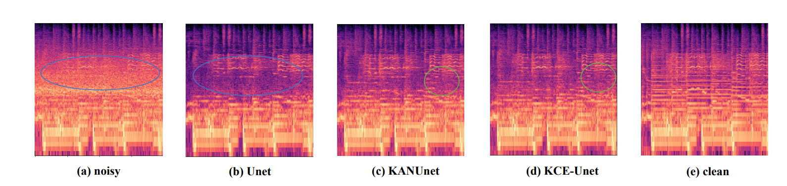

## Abstract
During concerts, people often spontaneously record memorable moments with their phones. However, these recordings are frequently accompanied by noise, such as cheering and applause, which diminishes the playback experience. In this paper, we introduce a novel task specifically designed for denoising music in concert environments, a challenge that has been largely overlooked in previous research. To support this task, we created a new concert denoising dataset that includes songs performed in various major languages at concerts, accompanied by noise segments like cheering and applause. Building on this, we propose KANConv ECA Unet (KCE-Unet), a method that combines the U-Net network, Efficient Channel Attention (ECA), and the recently proposed KAN network to flexibly remove noise in the mid-to-high frequency range of spectrograms. Extensive experiments demonstrate that our method outperforms previous models in denoising performance and effectively restore disrupted musical structures.

  

<b>Figure 1: KCE-Unet Architecture</b>

## Dataset
### Clean concert music
To replicate the authentic auditory experience of live concert environments, we are the first to propose an extensive dataset. This dataset consists of high-quality recordings of concert music across multiple major languages.
### Noisy concert music
To simulate a realistic environment for music denoising research, we collect a large number of noise samples, specifically targeting background noise commonly found in live concert settings. These noise samples include various types of applause, cheering, and screaming, sourced from Freesound {https://freesound.org/} and various online platforms. 

## Denosing samples

  

<b>Figure 2:Comparison of spectrograms for different methods. </b>

